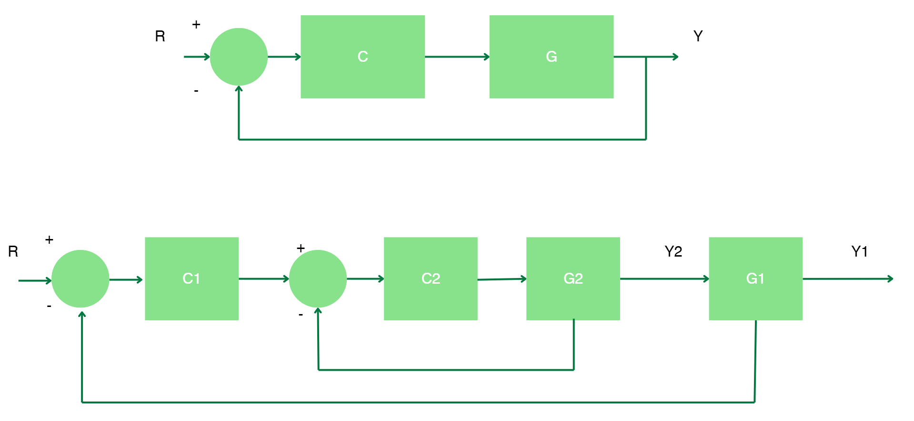

# Control de Movimiento - CLASE 2

# Control en Cascada

El control en cascada es una estrategia de control utilizada para mejorar la estabilidad y respuesta de un sistema mediante la implementación de dos o más lazos de control jerárquicos.

### Esquema

###  Componentes del Control en Cascada
- **Controlador Primario (C1)**: Responsable de la variable principal.
- **Controlador Secundario (C2)**: Regula una variable interna más rápida.
- **Procesos G1 y G2**: Modelos matemáticos de los procesos controlados.

### Selección de Controladores
- C2 debe ser más rápido que C1.
- C2 suele ser **P o PI** para evitar ralentización.
- C1 puede ser **PI o PID** para minimizar el error.

### Casos de Aplicación
- Cuando las perturbaciones afectan el tiempo de establecimiento.
- Cuando hay variables internas más rápidas disponibles.
- Cuando se desea mejorar la dinámica de la variable controlada.

## Métodos de Sintonización
### Metodologías empíricas lazo abierto
- **Lazo abierto**: Se ajustan los controladores de forma independiente, por metodos conocidos y la interacción entre lazos.
  
  ## Ejemplo 
  

  $$ G_2 = \frac{0.5e^{-s}}{2s + 1} $$

  $$ G_1 = \frac{e^{-10s}}{15s + 1} $$

Sintonización lazo secundario  

  $$ G_2 = \frac{0.5e^{-s}}{2s + 1} $$

  $$ K_{c2} = \frac{0.9}{K_2} \left( \frac{\tau_2}{t_m} \right) = \frac{0.9}{0.5} \left( \frac{2}{1} \right) = 3.6 $$

  $$ T_{i2} = 3.33 t_m = 3.33 $$  

Sintonización lazo primario  

   

 $$ K_{Total} = K1 \times 1 = K1 = 1 $$

$$ t_{mTotal} = t_{m1} + t_{m2} $$
$$ = 10 + 1 = 11 $$

$$ \tau_{Total} \approx \tau_1 \approx 15 $$

$$ K_{c1} = \frac{1.2}{K_{Total}} \left( \frac{\tau_{Total}}{t_{mTotal}} \right) $$

$$ = \frac{1.2}{1} \left( \frac{15}{11} \right) = 1.63 $$  

$$ T_{i1} = 2 t_{mTotal} $$
$$ = 2 \times 11 = 22 $$

$$ T_{d1} = 0.5 t_{mTotal} $$
$$ = 0.5 \times 11 = 5.5 $$

##

- **Método Austin (1986)**: # Resumen  

-Sintonización en Lazo Abierto: El método de Austin (1986) permite ajustar sistemas en cascada con una sola prueba.  
Proporciona ecuaciones para sintonizar controladores primarios (PI o PID) cuando el controlador secundario es P o PI.  

-Sintonización: Consiste en aplicar un cambio de paso en la señal de la válvula de control y registrar la respuesta de las variables primarias y secundarias. A partir de la respuesta secundaria, se determinan la ganancia $$K_2$$, la constante de tiempo $$t_2$$ y el tiempo muerto $$t_{02}$$. Con la respuesta primaria, se obtienen la ganancia $$K_1$$, la constante de tiempo $$t_1$$ y el tiempo muerto $$t_{01}$$ del ciclo primario.  

**Sintonización**
| **PRIMARY**  | **PI** | **PID** |
|-------------|--------|--------|
| $$G_{c1}(s)$$ | $$\tau_{I1} = \tau_1$$ | $$\tau_{I1} = \tau_1$$ ; $$\tau_{D1} = \frac{t_{01} - t_2}{2}$$ |
| **SECONDARY** $$G_{c2}(s)$$ | $$K_{c1}$$ | $$K_{c1}$$ |
| **P** | $$1.4 \left[ \frac{1 + K_c K_2}{K_{c2} K_1} \right] \left[ \frac{t_{01}}{\tau_1} \right]^{-1.14} \left[ \frac{T_2}{\tau_1} \right]^{0.1}$$ | $$1.4 \left[ \frac{1 + K_c K_2}{K_{c2} K_1} \right] \left[ \frac{t_{01}}{\tau_1} \right]^{-1.14} \left[ \frac{T_2}{\tau_1} \right]^{0.1}$$ |
| **PI** | $$1.25 \left[ \frac{K_2}{K_1} \right] \left[ \frac{t_{01}}{\tau_1} \right]^{-1.07} \left[ \frac{T_2}{\tau_1} \right]^{0.1}$$ | $$1.25 \left[ \frac{K_2}{K_1} \right] \left[ \frac{t_{01}}{\tau_1} \right]^{-1.07} \left[ \frac{T_2}{\tau_1} \right]^{0.1}$$ |
| **Range** | $$0.02 \leq \left( \frac{T_2}{\tau_1} \right) \leq 0.38$$   $$t_{02} \leq t_{01}$$ | $$0.02 \leq \left( \frac{T_2}{\tau_1} \right) \leq 0.38$$   $$t_{02} \leq t_{01}$$   $$\frac{t_{01} - T_2}{2} \geq 0.08$$ |  

| **PRIMARY**  | **PI** | **PID** |
|-------------|--------|--------|
| $$G_{c1}(s)$$ | $$\tau_{I1} = \tau_1$$ | $$\tau_{I1} = \tau_1$$ ; $$\tau_{D1} = \frac{t_{01} - t_2}{2}$$ |
| **SECONDARY** $$G_{c2}(s)$$ | $$K_{c1}$$ | $$K_{c1}$$ |
| **P** | $$0.84 \left[ \frac{1 + K_c K_2}{K_{c2} K_1} \right] \left[ \frac{t_{01}}{\tau_1} \right]^{-1.14} \left[ \frac{T_2}{\tau_1} \right]^{0.1}$$ | $$1.17 \left[ \frac{1 + K_c K_2}{K_{c2} K_1} \right] \left[ \frac{t_{01}}{\tau_1} \right]^{-1.14} \left[ \frac{T_2}{\tau_1} \right]^{0.1}$$ |
| **PI** | $$0.75 \left[ \frac{K_2}{K_1} \right] \left[ \frac{t_{01}}{\tau_1} \right]^{-1.07} \left[ \frac{T_2}{\tau_1} \right]^{0.1}$$ | $$1.04 \left[ \frac{K_2}{K_1} \right] \left[ \frac{t_{01}}{\tau_1} \right]^{-1.07} \left[ \frac{T_2}{\tau_1} \right]^{0.1}$$ |
| **Range** | $$0.02 \leq \left( \frac{T_2}{\tau_1} \right) \leq 0.65$$   $$t_{02} \leq t_{01}$$ | $$0.02 \leq \left( \frac{T_2}{\tau_1} \right) \leq 0.35$$   $$t_{02} \leq t_{01}$$   $$\frac{t_{01} - T_2}{2} \geq 0.08$$ |

### Metodologías empíricas lazo cerrado
- **Método Hang (1994)**: Basado en pruebas de relé, primero sintonizando el lazo secundario y posteriormente el primario incluyendo dentro del lazo lo anterior. 

   

### 6. Ejemplos Adicionales
1. **Sistema de climatización**: El controlador primario ajusta la temperatura, mientras que el secundario regula el flujo de aire.
2. **Control de nivel en un tanque**: Un controlador ajusta el flujo de entrada mientras que otro regula la presión de salida.

### 7. Ecuaciones
- Función de transferencia del proceso secundario:
  \[ G_2 = \frac{0.5e^{-s}}{2s+1} \]
- Función de transferencia del proceso primario:
  \[ G_1 = \frac{e^{-10s}}{15s+1} \]
- Cálculo de ganancia del controlador secundario:
  \[ K_{c2} = \frac{0.9}{K_2} \frac{τ_2}{t_m} \]

### 8. Figuras
1. **Diagrama de bloques de un control en cascada**.
2. **Respuesta temporal de un sistema en cascada comparado con un sistema de control simple**.

### 9. Tablas
| Controlador | Tipo Recomendado |
|------------|-----------------|
| C1 (Primario) | PI o PID |
| C2 (Secundario) | P o PI |

### 10. Ejercicios
1. Diseña un sistema de control en cascada para una planta de calentamiento de líquidos.
2. Calcula la ganancia de los controladores para un sistema con parámetros específicos.

### 11. Conclusiones
- El control en cascada mejora la estabilidad y reduce los efectos de perturbaciones.
- La selección adecuada de controladores es clave para optimizar el desempeño.
- Diferentes métodos de sintonización pueden utilizarse dependiendo de la aplicación.

### 12. Referencias
- Smith, C., & Corripio, A. *Principles and Practice of Automatic Process Control*.
- Hang, C.C. *Relay Feedback Auto-Tuning Cascade Controllers*. IEEE, 1994.
- Austin, J. *Cascade Control Tuning Methods*. Industrial Engineering, 1986.

